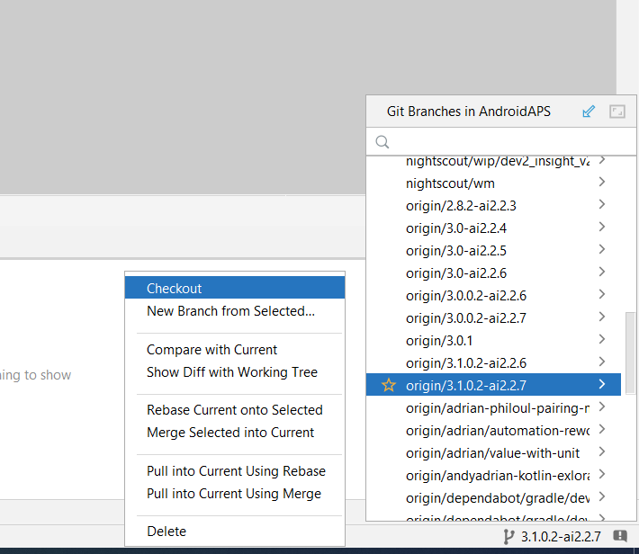

# AndroidAPS with autoISF
* For documentation about AndroidAPS without autoISF, check the wiki: https://androidaps.readthedocs.io
* Everyone who’s been looping with AndroidAPS needs to fill out the form after 3 days of looping  https://docs.google.com/forms/d/14KcMjlINPMJHVt28MDRupa4sz4DDIooI4SrW0P3HSN8/viewform?c=0&w=1

## What is autoISF?
AutoISF adds more power to the algorithm used in AndroidAPS by adjusting the insulin sensitivity based on different scenarios (e.g. high BG,
accelerating/decelerating BG, BG plateau). autoISF has many different settings to fine-tune these adjustments.
However, it is important to start with well-tested basal rate and settings for insulin sensitivity and carb ratios.

## Where to find documentation about autoISF
Please visit ga-zelle’s repository [GitHub - ga-zelle/autoISF](https://github.com/ga-zelle/autoISF/tree/A3.2.0.4_ai3.0.1).
  The [**Quick Guide**](https://github.com/ga-zelle/autoISF/blob/A3.2.0.4_ai3.0.1/autoISF3.0.1_Quick_Guide.pdf)  (bzw. [**Kurzanleitung**](https://github.com/ga-zelle/autoISF/blob/A3.2.0.4_ai3.0.1/autoISF3.0.1_Kurzanleitung.pdf)) provide an overview of autoISF and its features
 

## Why do I get AutoISF here and not at ga-zelle's Repo?
* The vast majority of the AutoISF design and development effort was done by [ga-zelle](https://github.com/ga-zelle) with support from
  [swissalpine](https://github.com/swissalpine), [claudi](https://github.com/lutzlukesch),
  [BerNie](https://github.com/bherpichb), [mountrcg](https://github.com/mountrcg),
  [Bjr](https://github.com/blaqone) and [myself](https://github.com/T-o-b-i-a-s).
* This repository here was created to provide a stable version of AndroidAPS with the current autoISF extensions
  already integrated to simplify the build process.
* This branch https://github.com/T-o-b-i-a-s/AndroidAPS/tree/3.2.0.4-ai3.0.1 uses
  AndroidAPS 3.2.0.4 (which is the `master` version on the official [Nightscout AndroidAPS]
  (https://github.com/nightscout/AndroidAPS)
  repo by the time when this text was written) as a base and adds autoISF 3.0.1 to it.

## What's new in autoISF Version 3.0.1 when compared to 3.0
Details of the new features are listed in the standard documents shown above. Important examples are
* Support for 1-minute glucose values from Freestyle Libre 2 or 3
* Reduced and simplified number of autoISF settings

## How to build this branch in Android Studio
1. Close any currently open projects in Android Studio
2. Create a new project by using the "Get from VCS" button to tell it to retrieve the source from a remote version control system
3. Use the url of this repository as a source (https://github.com/T-o-b-i-a-s/AndroidAPS.git). Do NOT append any branch name
   or version number or other path, **just use the URL as listed above**!
4. Now wait until Android has completed any initialization activities. As always deny any requests to upgrade Gradle. A "Gradle sync" might however be necessary.
5. Android Studio now shows the name of the current branch in the lower right corner. In some operating systems, the branch name is shown on the upper left within the title bar. 
* Usually this will be `master`, which contains an out-dated version of AndroidAPS, do **not** use the `master` branch
* If it is not already selected, switch to the branch you want to build by clicking on the branch name,
  choosing "show more" under "Remote branches" and look for the name of
  the branch with an "origin/" prefix: e.g. origin/3.2.0.4-ai3.0.1 . Left-click that name and
  select "Checkout". The following screenshot shows how this will look like in Win 10 Android Studio (a different branch was used here):
  
6. The system will now create a local branch with the same name as the remote branch and switch to that branch, which is indicated by the name of
   the branch being shown in the lower right corner / upper right corner
7. You can now build the APK with Build -> Generate signed Bundle / APK
8. In case of any error messages during the build, try to first run a "Clean build" by selecting
   Build -> Clean to remove any remnants from previous builds and then start the APK build again.
9. If you experience recurring problems with building the APK, as a last resort consider to
   delete your current Android Studio completely, reinstall the most recent version and clone
   this repo into a new directory on your computer (different than the one you have used before).

## What can I do if the build does not work?
* Follow the instructions exactly as described. Carefully re-read all previous and the failing step and try to start from scratch.
* Make sure you used "https://github.com/T-o-b-i-a-s/AndroidAPS.git" as the URL to "Get from VCS" and none including the branch or version name
* If you have problems understanding English and need a translation, consider using an automatic translation tool such as
  https://www.deepl.com where you have to copy and paste the english text to get it translated or use
  [Google Translate](https://github-com.translate.goog/T-o-b-i-a-s/AndroidAPS?_x_tr_sl=en&_x_tr_tl=de&_x_tr_hl=de&_x_tr_pto=wapp)
  to automatically translate the whole page (target language is set to German in this example, but can be changed at the top).

General remark:
If you have been working with AndroidAPS 2.x before and this is the first time you build a 3.x version,
please first build and run the regular AndroidAPS 3.x version from
https://github.com/nightscout/AndroidAPS and double-check that this works fine.
Only then upgrade to the version including autoISF.

For questions or feedback, please contact us at https://de.loopercommunity.org/t/woher-wie-autoisf/
